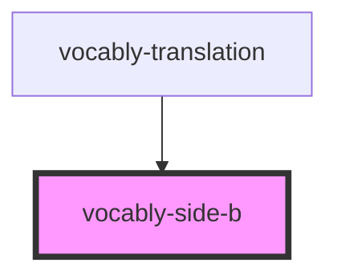

# vocably-side-b

<!-- Auto Generated Below -->

## Properties

| Property | Attribute | Description | Type     | Default     |
| -------- | --------- | ----------- | -------- | ----------- |
| `text`   | `text`    |             | `string` | `undefined` |

## Dependencies

### Used by

- [vocably-translation](../vocably-translation)

### Graph

---

_Built with [StencilJS](https://stenciljs.com/)_
