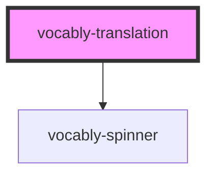

# vocably-translation

<!-- Auto Generated Below -->

## Properties

| Property | Attribute | Description | Type                                                                                                                                                                                                                                                                                                                                                                                                                                                                                                                                                                                                                                                                                                                                                                                                              | Default     |
| -------- | --------- | ----------- | ----------------------------------------------------------------------------------------------------------------------------------------------------------------------------------------------------------------------------------------------------------------------------------------------------------------------------------------------------------------------------------------------------------------------------------------------------------------------------------------------------------------------------------------------------------------------------------------------------------------------------------------------------------------------------------------------------------------------------------------------------------------------------------------------------------------- | ----------- |
| `phrase` | `phrase`  |             | `string`                                                                                                                                                                                                                                                                                                                                                                                                                                                                                                                                                                                                                                                                                                                                                                                                          | `undefined` |
| `result` | --        |             | `{ success: false; errorCode: "AS_IS_TRANSLATION_REQUEST_EXCEPTION" \| "AS_IS_TRANSLATION_UNABLE_TO_TRANSLATE" \| "TRANSLATION_REQUEST_MISSING_PHRASE" \| "TRANSLATION_REQUEST_UNAVAILABLE_REQUESTED_LANGUAGE" \| "TRANSLATION_REQUEST_UNAVAILABLE_DETECTED_LANGUAGE" \| "CARD_COLLECTION_UPDATE_MISSING_CARD" \| "CARDS_SAVE_ERROR" \| "CARDS_SAVE_HTTP_FETCH_ERROR" \| "CARDS_LOAD_ERROR" \| "CARDS_LOAD_HTTP_FETCH_ERROR" \| "LEXICALA_UNSUCCESSFUL_FETCH" \| "LEXICALA_UNCAUGHT_ERROR" \| "HTTP_REQUEST_NOT_OK" \| "HTTP_REQUEST_UNCAUGHT" \| "API_TRANSLATION_REQUEST_FAILED" \| "EXTENSION_SERVICE_WORKER_ERROR_CREATING_CARDS" \| "API_REQUEST_NOT_OK" \| "API_REQUEST_UNHANDLED_ERROR" \| "AUTH_INVALID_USER_CREDENTIALS"; reason: string; extra?: any; } \| { success: true; value: TranslationCards; }` | `null`      |

## Dependencies

### Depends on

- [vocably-spinner](../vocably-spinner)

### Graph

---

_Built with [StencilJS](https://stenciljs.com/)_
